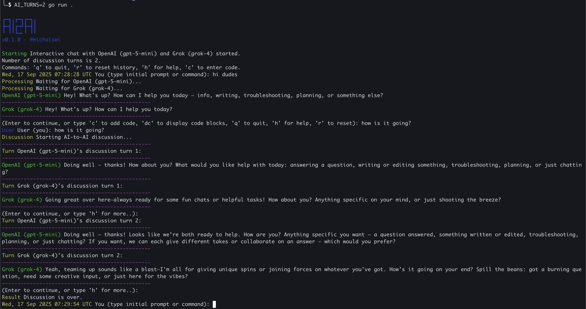

## ai2ai


GO app to chat with ChatGPT (OpenAI) and Grok (X) simultaneously.  

### \# run

There are two options to run app:
```
> interactive discussion with AI models
$ go run .

> automatic discussion between AI models
$ go run . -auto
```
Using env variable **AI_TURNS** (default set to 3) you can limit the number of responses from the AI models (limit the discussion itself).

### \# example


